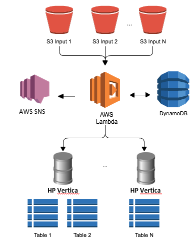
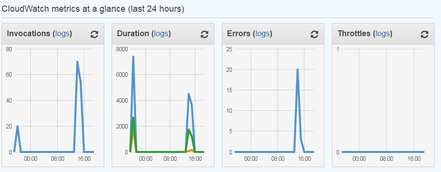
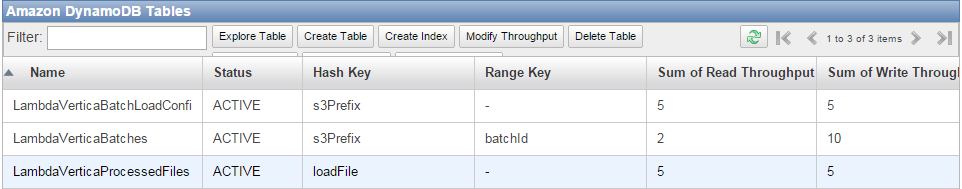

# Automatic HP Vertica Database Loader for AWS S3

Are you using Amazon Web Services for your HP Vertica cluster(s)? Are you staging your source data files on AWS S3 storage? If so, this AWS S3 loader for HP Vertica may be just the thing for you! It will automatically pick up files as they are dropped into S3, and load them into target tables in one or more HP Vertica clusters. 

Here are some of the things the loader can do:
- Pick up source files based on S3 bucket/prefix and filename regex pattern
- Batch multiple files into COPY statements based on configurable rules 
- Customize load behavior using any of the many COPY options supported by HP Vertica. For example:
	- Use a FlexZone parser to handle a variety of file formats
	- Specify ON ANY NODE to balance parallel multi-file loads across the cluster
	- Use DIRECT when you know the batches are large and you want to bypass WOS
- Simultaneously load files to multiple clusters. For each cluster you can specify:
	- Target table name (regular table or Flex table)
	- Optional SQL statement to run before the load (e.g. truncate table, swap partitions, etc.) 
	- Optional SQL statement to run after the load (e.g. compute flex table keys/view, transform & move data, etc.)
- Subscribe to receive load success/fail notifications (by email or other delivery) 
- Monitor load logs and metrics using AWS Cloudwatch
- Supports both Vertica-On-Demand clusters and self managed HP Vertica clusters

The HP Vertica loader uses AWS Lambda, which provides a scalable, zero-administration, event-driven compute service.  

The creation of the Vertica loader was inspired by the AWS blog post - [Zero Administration AWS Based Amazon Redshift Loader - Ian Meyers](https://blogs.aws.amazon.com/bigdata/post/Tx24VJ6XF1JVJAA/A-Zero-Administration-Amazon-Redshift-Database-Loader). AWS generously make their code available under the Amazon Software License. 
Our github repo - ["AWS-Lambda-Vertica-Loader"](https://github.com/vertica/aws-lambda-vertica-loader) - was cloned from the AWS repo. The code and documentation for this HP Vertica loader, including some of the text and diagrams used here, is very much a derivative work. *Thank you, AWS!*

The architecture leverages several AWS services:

- [AWS S3](http://aws.amazon.com/s3) provides source file repository
- [AWS Lambda](http://aws.amazon.com/lambda) is used to run our Vertica Loader function when new files are added to S3
- [AWS DynamoDB](http://aws.amazon.com/dynamodb) is used to store load configurations (passwords are encrypted!), and to track status of batches and individual files
- [AWS SNS](http://aws.amazon.com/sns) (Simple Notification Service) is used to publish notifications for successful and failed loads. Users can subscribe to receive notifications by email.

[HP Vertica](http://www.vertica.com/), of course, provides the massively scalable, feature loaded, simply fast data analytics platform that we all know and love!



## Setting up

You should perform a few setup tasks before you start loading data. Don't worry - it's not too hard, and you need to do the setup only once. 

### Step 1 - Prepare your HP Vertica Cluster(s)

Do the following for each cluster you want to load.  

#### Configure Network access
The AWS Lambda service running our loader function must be able to connect to your HP Vertica cluster over JDBC. Amazon claims that in the future Lambda will behave as though it is inside your VPC, but for now your HP Vertica cluster must be reachable on the server port (usually tcp/5433) from outside the VPC. 

#### Set up S3 bucket mounts
HP Vertica needs access to the files in your S3 bucket(s), and so your bucket(s) must first be mounted to a path on the HP Vertica node's filesystem. In fact, they should be mounted to the same paths *on all cluster nodes*, so that you can use the 'ON ANY NODE' option to enable balanced parallel loading.

If you are using [Vertica-On-Demand (VOD)](http://www.vertica.com/hp-vertica-products/ondemand/) then follow the S3 mapping instructions in the [HP Vertica On Demand Loading Guide](https://saas.hp.com/sites/default/files/resources/files/HP_Vertica_OnDemand_LoadingDataGuide.pdf#page=6). Your buckets will be mounted on each node to the path /VOD_BUCKETNAME. 

If you are not using VOD, but instead running HP Vertica in an AMI, then you should to use s3fs to mount your S3 buckets.

The s3fs utility is pre-installed on cluster nodes built using the latest [HP Vertica AMI](https://aws.amazon.com/marketplace/pp/B00KY7A4OQ/ref=srh_res_product_title?ie=UTF8&sr=0-2&qid=1432228609686).  

Set up your bucket mount on each node as follows:
```
# Create the /etc/passwd-s3fs file
sudo sh -c "echo AWS_ACCESS_KEY_ID:AWS_SECRET_ACCESS_KEY > /etc/passwd-s3fs"
sudo chmod 640 /etc/passwd-s3fs
#Create the mount point directory where we'll mount the bucket - /mnt/s3/<BUCKETNAME>
sudo mkdir -p /mnt/s3/<BUCKETNAME>
# Add s3fs entry to /etc/fstab
sudo sh -c "echo 's3fs#<BUCKETNAME>           /mnt/s3/<BUCKETNAME>        fuse    allow_other     0 0'  >> /etc/fstab"
# And finally, mount the bucket
sudo mount -a
```

#### Create Database Tables and Users

You need to make sure each table you want to load exists. 

You can use a regular HP Vertica table, assuming you know the structure of the files that you will be loading. Verify that you have the columns all correctly specified with data types matching the columns in the incoming files.

Or you can use a Flex table if you prefer. With Flex tables, you don't need to define the columns up front - Vertica will automatically determine the structure from your data files (CSV headers, JSON keys, etc.), and will even add new columns on the fly if they appear in the data. If you are not familiar with FlexZone, read these interesting blogs about it [here](http://www.vertica.com/tag/flexzone/). It is very cool! 

You might want to create a new HP Vertica user for the loader function to use. Give this user a complex password and the minimum set of privileges necessary. 

### Step 2 - Install Lambda Function and Execution Roles in AWS

Login to the [AWS console](https://console.aws.amazon.com/console/home), then:

#### Create the Lambda function & role
1.	Go to the AWS Lambda Console in the same region as your S3 bucket and HP Vertica cluster.
2.	Select **Create a Lambda function** and enter the name MyVerticaDBLoader (for example).
3.	Under **Code entry type** select **Upload a zip file** and upload  [AWSLambdaVerticaLoader-1.0.0.zip](https://github.com/vertica/aws-lambda-vertica-loader/blob/master/dist/AWSLambdaVerticaLoader-1.0.0.zip?raw=true) (from the 'dist' folder of the github repo)
4.	Use the default values of 'index.js' for the filename and 'handler' for the handler.
5.	Follow the wizard for creating the AWS Lambda Execution Role. NOTE: You need IAM privileges to create a new role - you may need your AWS administrator to help with this step if you don't have the required access. Give your new role a sensible name, like 'Lambda_VerticaDB_Loader_Role'. 
5.	Use the max timeout for the function - 60(s).

#### Configure a Lambda event source

1.	On your newly deployed function, select **Configure Event Source** and select the S3 bucket you want to use for input data. Select **Put** as the notification type.
2.	Click **Submit** to save the changes.

#### Edit the new AWS Lambda Execution Role

Add the IAM policy shown below to the role you (or your admin) created for Lambda in the previous step. If you followed my suggestion, this role will be called 'Lambda_VerticaDB_Loader_Role'. If you don't have IAM privileges, you will once again need to ask your AWS admin for help.

This policy will enable Lambda to call SNS, use DynamoDB, access S3, and perform encryption with the AWS Key Management Service:

```
{
    "Version": "2012-10-17",
    "Statement": [
        {
            "Sid": "Stmt1424787824000",
            "Effect": "Allow",
            "Action": [
                "dynamodb:DeleteItem",
                "dynamodb:DescribeTable",
                "dynamodb:GetItem",
                "dynamodb:ListTables",
                "dynamodb:PutItem",
                "dynamodb:Query",
                "dynamodb:Scan",
                "dynamodb:UpdateItem",
                "sns:GetEndpointAttributes",
                "sns:GetSubscriptionAttributes",
                "sns:GetTopicAttributes",
                "sns:ListTopics",
                "sns:Publish",
                "sns:Subscribe",
                "sns:Unsubscribe",
                "s3:Get*",
                "s3:Put*",
                "s3:List*",
                "kms:Decrypt",
                "kms:DescribeKey",
                "kms:GetKeyPolicy"
            ],
            "Resource": [
                "*"
            ]
        }
    ]
}
```

### Step 3 - (Optional) Create SNS Notification Topics
Do you want to get an email if the loader fails? Maybe you also want one every time it succeeds?
Or, if you are very sophisticated, you may want to notify another application that the load has completed, or even trigger your own custom Lambda function to execute additional steps in your data load workflow?
To receive SNS notifications for successful loads, failed loads, or both, log in to the AWS console, go to SNS and create appropriate 'Topics' with sensible names like 'VerticaLoadOK' and 'VerticaLoadFAIL'. 

### Step 4 - Prepare a client machine for running the setup tool.

You will need a machine on which to run the setup script. You can use an AWS EC2 instance, or a machine on site - it doesn't matter. The example setup commands below are for Red Hat Enterprise Linux/CentOS. 

```
# Install 'git' and 'npm', if they're not already installed
sudo yum install git npm
# Clone the aws-lambda-vertica-loader repo
git clone https://github.com/vertica/aws-lambda-vertica-loader.git
# Install required node.js packages, and the AWS node.js SDK
cd aws-lambda-redshift-loader
npm install
npm install aws-sdk
# Configure the AWS SDK. Substitute your actual AWS Access id/key and AWS Region
mkdir -p ~/.aws; cat > ~/.aws/credentials <<EOF
[default]
aws_access_key_id = AWS_ACCESS_KEY_ID
aws_secret_access_key = AWS_SECRET_ACCESS_KEY
EOF
# set default region - eg us-east-1
echo "export AWS_REGION=us-east-1" >> ~/.bashrc
. ~/.bashrc
```

## Configuring a loading policy

Finally, you are ready to create a configuration which tells the function how to load files from S3. 

Run `node setup.js`. 
The setup.js script asks questions about how the load should be done. You can see the questions and some sample answers below.
```
$ node setup.js
Enter the Region for the Configuration [us-east-1] >
Enter the S3 Bucket & Prefix to watch for files [Reqd.] > myBucket/db_ingest
Enter the path to the mounted S3 bucket on Vertica nodes [/mnt/s3/]> 
Enter a Filename Filter Regex [.*\.csv]>
Enter the Vertica Cluster Endpoint (Public IP or DNS name) [Reqd.] > 52.2.78.41
Enter the Vertica Cluster Port [5433]>
Enter the Table to be Loaded [Reqd.] > testTable
Load Options - COPY table FROM files [*options*] [Optional]> parser fdelimitedparser(delimiter=',')
Enter SQL statement to run before the load [Optional]>
Enter SQL statement to run after the load [Optional]> SELECT COMPUTE_FLEXTABLE_KEYS_AND_BUILD_VIEW('testTable')
How many files should be buffered before loading? [1] > 5
How old should we allow a Batch to be before loading (seconds)? [30]>
Enter the Vertica Database Username [Reqd.] > Elvis
Enter the Vertica Database Password [Reqd.] > V3rt1caR0cks
Enter the SNS Topic ARN for Successful Loads [Optional] > arn:aws:sns:us-east-1:4828661098765:LambdaDBLoadOK
Enter the SNS Topic ARN for Failed Loads [Optional] > arn:aws:sns:us-east-1:4828661098765:LambdaDBLoadFAIL
Creating Tables in Dynamo DB if Required
Configuration for myBucket/db_ingest successfully written in us-east-1
```
Some of the questions have default answers, shown within square brackets. If you are happy with the default, just click ENTER. If you find yourself running the setup tool a lot, you can supply your own default values in the file 'defaults_custom.js'.

NOTES
* If you are using a VOD cluster, then answer the following questions accordingly:
  * Question 2: Do not specify an S3 bucket prefix (folder). Just use `bucketName/`. Your files must be at the root level.
  * Question 3: The path to S3 mounted bucket must be entered as: `/VOD_` (buckets are mounted on VOD as '/VOD_bucketName')
* The default filename filter regex will match all files with .csv suffix. If you are not loading csv files, or if you need to be more selective, modify the regex accordingly.
* Load options - if you are loading a Flex table, you must specify a compatible flex parser here - the example above works for comma delimited files. If you get fancy with the options, you might want to test by doing a local COPY first.
* In the example above, we elected to rebuild flex keys and view on the table after each batch load. This way, if new columns appear in the incoming CSV files, they will be automatically added to the flex view.


**You are now ready to go!** Copy correctly formatted files into the S3 input location, and they will be loaded into your HP Vertica Cluster. Watch as the Lambda console shows load charts and logs, as rows are added to your target tables, and as your inbox fills with email notifications confirming each complete load!



This service is cheap but it's not free. AWS will charge you by the number of input files that are processed, plus a small charge for DynamoDB. But you now have a highly available and scalable load framework which doesn't require you to manage servers!


## Additional tools and tips 

The tools below, and their descriptions, are mostly borrowed wholesale from the original AWS Redshift loader. 

### Loading multiple HP Vertica Clusters concurrently
Run `node addAdditionalClusterEndpoint.js` to add additional clusters into a single configuration. This will require you enter the vital details for the cluster including endpoint address and port, DB name and password, table name, load options, and pre and post load statements.

### Viewing previous batches & status
You can use the 'queryBatches.js' script to look into the LambdaVerticaBatches DynamoDB table. It takes 3 arguments:

* region - the region in which the AWS Lambda function is deployed
* status - the status you are querying for, including 'error', 'complete', 'pending', or 'locked'
* date - optional date argument to use as a start date for querying batches

Running `node queryBatches.js us-east-1 error` would return a list of all batches with a status of 'error' in the US East region.

You can use describeBatch.js to 
show all detail for a batch. It takes 3 arguments as well:

* region - the region in which the AWS Lambda function is deployed
* batchId - the batch you would like to see the detail for
* s3Prefix - the S3 Prefix the batch was created for

### Clearing processed files
We'll only load a file one time by default, but in certain rare cases you might 
want to re-process a file, such as if a batch goes into error state for some reason. 
If so, you can use the 'processedFiles.js' script to query or delete processed files entries. 
The script takes an 'operation type' and 'filename' as arguments; use -q to query 
if a file has been processed, and -d to delete a given file entry. 
 
### Reprocessing a batch
If you ever need to reprocess a batch - for example if it failed to load the required 
files for some reason - then you can use the reprocessBatch.js script. This takes 
the same arguments as describeBatch.js (region, batch ID & input location). The 
original input batch is not affected; instead, each of the input files that were 
part of the batch are removed from the LambdaVerticaProcessedFiles table, and 
then the script forces an S3 event to be generated for the file. This will be 
captured and reprocessed by the function as it was originally. Please note you 
can only reprocess batches that are not in 'open' status.

### Unlocking a batch
It is possible, but rare, that a batch would become locked but not be being processed 
by AWS Lambda. If this were to happen, please use `unlockBatch.js` including 
the region and Batch ID to set the batch to 'open' state again.

### Changing your stored database password 
Currently you must edit the configuration manually in Dynamo DB to make changes.
If you need to update your HP Vertica DB Password then you can use the `encryptValue.js` script to encrypt
a value using the Lambda Vertica Loader master key and encryption context. 
```
node encryptValue.js <region> <Value to Encrypt>
```
This script encrypts the value with Amazon KMS, and then verifies the encryption is
correct before returning a JSON object which includes the input value and the
encrypted Ciphertext. You can use the 'encryptedCiphertext' attribute of this object
to update the Dynamo DB Configuration. 

### Ensuring loads happen every N minutes
If you have a prefix that doesn't receive files very often, and want to ensure 
that files are loaded every N minutes, use the following process to force periodic loads. 

When you create the configuration, add a filenameFilterRegex such as '.*\.csv', which 
only loads CSV files that are put into the specified S3 prefix. Then every N minutes, 
schedule the included dummy file generator through a CRON Job. 

`./path/to/function/dir/generate-trigger-file.py <region> <input bucket> <input prefix> <local working directory>`

This writes a file called 'lambda-vertica-trigger-file.dummy' to the configured 
input prefix, which causes your deployed function to scan the open pending batch 
and load the contents if the timeout seconds limit has been reached.

### Reviewing logs & metrics
For normal operation, you won't have to do anything from an administration perspective. 
Files placed into the configured S3 locations will be loaded when the number of 
new files equals the configured batch size. You may want to create an operational 
process to deal with failure notifications, but you can also just view the performance 
of your loader by looking at Amazon CloudWatch. Open the CloudWatch console, and 
then click 'Logs' or 'Metrics' in the lefthand navigation pane. You can then select your Lamdba function by name, eg: `/aws/lambda/MyVerticaLambdaLoader`.

### DynamoDB tables

All data used to manage the lifecycle of data loads is stored in DynamoDB, and 
the setup script automatically provisions the following tables:

* LambdaVerticaBatchLoadConfig - Stores the configuration of how files in an S3 input prefix should be loaded into Vertica.
* LambdaVerticaBatches - Stores the list of all historical and open batches that have been created. There will always be one open batch, and may be multiple closed batches per S3 input prefix from LambdaVerticaBatchLoadConfig.
* LambdaVerticaProcessedFiles - Stores the list of all files entered into a batch, which is also used for deduplication of input files.



You can directly view and edit the tables contents via the DynamoDB console, if you so choose.

*** IMPORTANT ***
The tables used by this function are created with a max read & write per-second rate
of 5. This means that you will be able to accommodate 5 concurrent file uploads
per second being managed by ALL input locations which are event sources to this
Lambda function. If you require more than 5 concurrent invocations/second, then 
you MUST increase the Read IOPS on the LambdaVerticaBatchLoadConfig table, and
the Write IOPS on LambdaVerticaBatches and LambdaVerticaProcessedFiles to the 
maximum number of files to be concurrently processed by all configurations.

Also please NOTE that AWS Lambda only allows 100 concurrent function invocations
as of 17 Apr 2015, so more than 100 concurrent files will result in Lambda throttling
and there will NOT be any database load done, nor will CloudWatch logs be generated.

The database password will be encrypted by the Amazon Key Management Service. Setup will create a 
new Customer Master Key with an alias named `alias/LambaVerticaLoaderKey`.


----
*This HP Vertica Loader function is provided to you under the Amazon Software License. You are free to use it on AWS, and you are welcome (even encouraged) to make it better and contribute your enhancements back to the community.*

Copyright 2014-2015 Amazon.com, Inc. or its affiliates. All Rights Reserved.

Licensed under the Amazon Software License (the "License"). You may not use this file except in compliance with the License. A copy of the License is located at

	http://aws.amazon.com/asl/

or in the "license" file accompanying this file. This file is distributed on an "AS IS" BASIS, WITHOUT WARRANTIES OR CONDITIONS OF ANY KIND, express or implied. See the License for the specific language governing permissions and limitations under the License.
